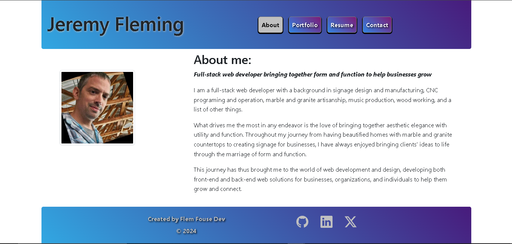
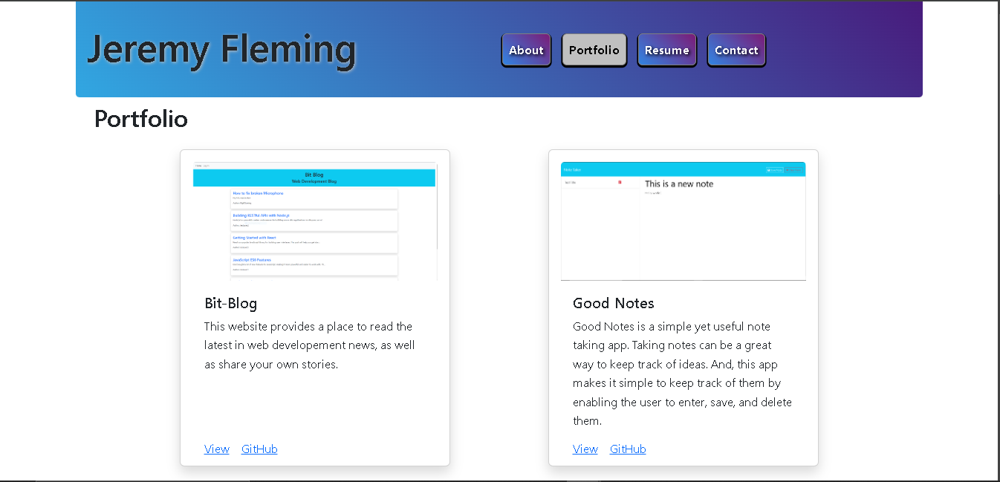
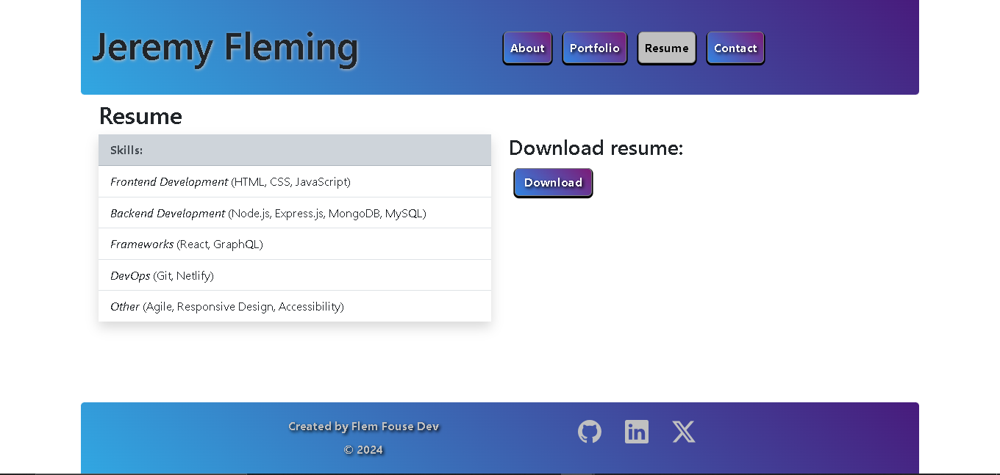
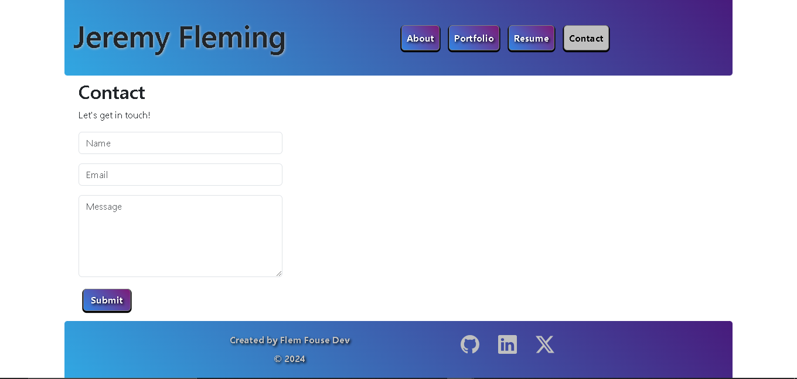

# Flem House Dev Portfolio
  
  ## Description
  Welcome to my portfolio! Here you will find a little information about myself, projects I have worked on, and how to get in touch.
  ## Table of Contents

  1. [Installation](#Installation)
  2. [Usage](#Usage)
  3. [License](#License)
  4. [Questions](#Questions)

  ## Installaion
  There is no installation required. Simply visit [JeremyFlemingDev](https://jeremyflemingdev.netlify.app/) online.
  
  ## Usage
  
  At the Flem House Dev portfolio site, you can learn about my background and skill set. Or, you can browse and see for yourself the various projects I have worked on. If you would like learn more about working together to help your business grow, simply fill out the contact form or click on one of the social media account links at the bottom of the page. 

  I look forward to working with you!
  -Jeremy Fleming

  

  

  

  

  ## License
  This software uses the MIT License.
  ## Questions
  If you have any questions, or if you would like to see more projects or would like to contribute, please visit: [Flem-House-Dev](https://github.com/Flem-House-Dev).
